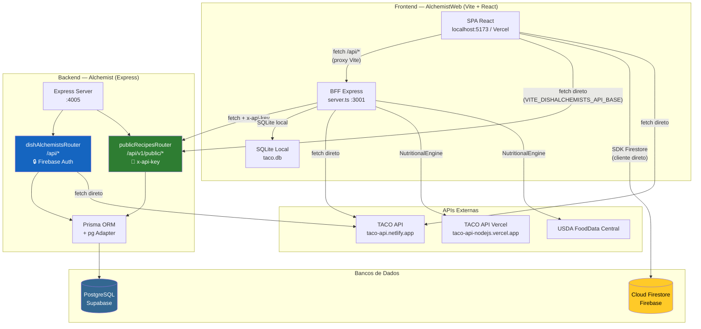
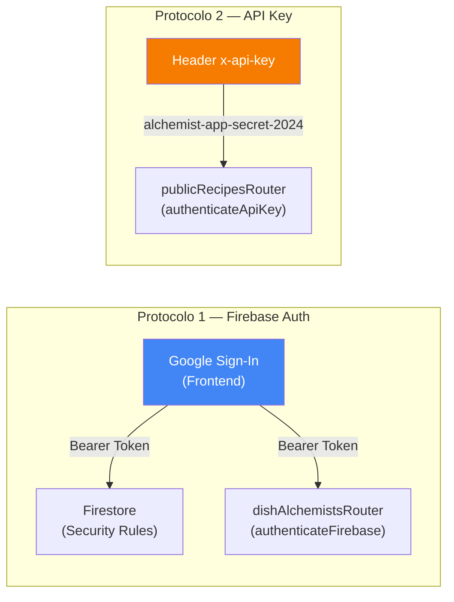

# Avaliação Detalhada — Mecanismos de Conexão e Acesso a Dados

## Visão Geral da Arquitetura



---

## 1. Inventário de Conexões por Serviço

### 1.1 — [apiService.ts](file:///mnt/46F84CA3F84C935B/SAGACITAS_SaaS/AlchemistWeb/Alchemist-Web/src/services/apiService.ts) (Receitas do PostgreSQL)

| Aspecto | Detalhe |
|---|---|
| **Destino** | Backend Alchemist `:4005` via `publicRecipesRouter` |
| **Protocolo** | HTTP REST + header `x-api-key` |
| **Autenticação** | API Key estática (`alchemist-app-secret-2024`) |
| **Banco real** | PostgreSQL (Supabase) via Prisma |
| **Modos de operação** | **Modo BFF** (`/api` → proxy Vite → BFF :3001 → backend :4005) OU **Modo Direto** (VITE_DISHALCHEMISTS_API_BASE aponta direto para :4005) |
| **Rotas consumidas** | `GET /recipes`, `GET /recipes/:id`, `GET /search`, `GET /categories` |

> [!WARNING]
> **Inconsistência de rotas**: A rota de busca no backend público é `/search`, mas o `apiService` chamava `/recipes/search`. Foi parcialmente corrigida com lógica condicional `isBff`, mas essa bifurcação fragiliza a manutenção.

---

### 1.2 — [plannerService.ts](file:///mnt/46F84CA3F84C935B/SAGACITAS_SaaS/AlchemistWeb/Alchemist-Web/src/services/plannerService.ts) (Planejamento Semanal)

| Aspecto | Detalhe |
|---|---|
| **Destino** | Cloud Firestore (Firebase) — **acesso direto do navegador** |
| **Protocolo** | SDK Firebase Client (WebSocket / HTTPS) |
| **Autenticação** | Firebase Auth (Google Sign-In) |
| **Banco real** | Firestore `families/{familyId}/weeklyPlans` |
| **Passagem pelo backend** | ❌ Nenhuma — comunicação 100% cliente-Firestore |

---

### 1.3 — [shoppingService.ts](file:///mnt/46F84CA3F84C935B/SAGACITAS_SaaS/AlchemistWeb/Alchemist-Web/src/services/shoppingService.ts) (Lista de Compras)

| Aspecto | Detalhe |
|---|---|
| **Destino** | Cloud Firestore (Firebase) — **acesso direto do navegador** |
| **Protocolo** | SDK Firebase Client |
| **Autenticação** | Firebase Auth |
| **Banco real** | Firestore `families/{familyId}/shoppingLists/main_list` |

---

### 1.4 — [consumptionService.ts](file:///mnt/46F84CA3F84C935B/SAGACITAS_SaaS/AlchemistWeb/Alchemist-Web/src/services/consumptionService.ts) (Logs de Consumo)

| Aspecto | Detalhe |
|---|---|
| **Destino** | Cloud Firestore (Firebase) — **acesso direto do navegador** |
| **Protocolo** | SDK Firebase Client |
| **Autenticação** | Firebase Auth |
| **Banco real** | Firestore `families/{familyId}/consumptionLogs` |

---

### 1.5 — [userService.ts](file:///mnt/46F84CA3F84C935B/SAGACITAS_SaaS/AlchemistWeb/Alchemist-Web/src/services/userService.ts) (Usuários e Família)

| Aspecto | Detalhe |
|---|---|
| **Destino** | Cloud Firestore (Firebase) — **acesso direto do navegador** |
| **Protocolo** | SDK Firebase Client |
| **Autenticação** | Firebase Auth |
| **Banco real** | Firestore `users/{uid}`, `families/{familyId}`, `families/{familyId}/members` |

---

### 1.6 — [tacoService.ts](file:///mnt/46F84CA3F84C935B/SAGACITAS_SaaS/AlchemistWeb/Alchemist-Web/src/services/tacoService.ts) (Alimentos TACO)

| Aspecto | Detalhe |
|---|---|
| **Destino** | API externa `https://taco-api.netlify.app/api/v1` |
| **Protocolo** | HTTP REST público (sem autenticação) |
| **Fallback** | Dados mock estáticos hardcoded no frontend |

---

### 1.7 — [NutritionalEngineService.ts](file:///mnt/46F84CA3F84C935B/SAGACITAS_SaaS/AlchemistWeb/Alchemist-Web/src/services/NutritionalEngineService.ts) (Motor Nutricional)

| Aspecto | Detalhe |
|---|---|
| **Destino 1** | API TACO (Vercel) `taco-api-nodejs.vercel.app` |
| **Destino 2** | USDA FoodData Central API |
| **Protocolo** | HTTP REST |
| **Autenticação** | USDA requer API Key via `process.env.USDA_API_KEY` |

> [!CAUTION]
> **Bug crítico**: Este serviço usa `process.env.USDA_API_KEY`, mas roda **no navegador** (importado pelo frontend via Vite). No navegador, `process.env` é `undefined`. A API Key da USDA nunca é lida. O motor nutricional do lado do cliente **jamais consulta a USDA** — apenas a TACO funciona.

---

## 2. Mapa de Bancos de Dados e Responsabilidades

| Banco | Tecnologia | Conteúdo | Quem acessa |
|---|---|---|---|
| **PostgreSQL** (Supabase) | Prisma ORM + `pg` adapter | Receitas, Ingredientes, GlobalFoodItem, Usuários do site principal | Backend Alchemist (exclusivamente) |
| **Cloud Firestore** (Firebase) | SDK Firebase Client | Famílias, Membros, Planos Semanais, Listas de Compras, Logs de Consumo | Frontend AlchemistWeb (diretamente do navegador) |
| **SQLite** (taco.db) | sqlite3 | 3 alimentos de exemplo (arroz, feijão, frango) | BFF do AlchemistWeb (:3001) — **nunca é consultado pelo frontend** |
| **APIs externas** (TACO, USDA) | HTTP REST | Tabelas nutricionais completas | Frontend e Backend (independentemente) |

---

## 3. Protocolos de Autenticação



| Protocolo | Onde é usado | Segurança |
|---|---|---|
| **Firebase Auth** (Bearer Token) | `dishAlchemistsRouter` (rotas internas `/api/*`), acesso direto ao Firestore | ✅ Forte — token JWT verificado server-side |
| **API Key estática** | `publicRecipesRouter` (rotas públicas `/api/v1/public/*`) | ⚠️ Média — chave fixa, sem expiração, exposta no `.env` do frontend |
| **Bypass em dev** | `publicRecipesRouter` pula auth se `APP_API_KEY` estiver vazia | ⚠️ Risco se deployar sem configurar |

---

## 4. Fluxos de Dados — Cenários Reais

### Cenário A: Consultar receitas no dev local

```
Browser :5173
  → fetch("/api/recipes")
  → Vite Proxy → localhost:3001
  → BFF server.ts → fetch("http://localhost:4005/api/v1/public/recipes", { x-api-key })
  → publicRecipesRouter → Prisma → PostgreSQL (Supabase)
  → Response JSON ← ← ← ← ← Browser
```

> [!NOTE]
> **Porém**, o `.env` do frontend define `VITE_DISHALCHEMISTS_API_BASE=http://localhost:4005/api/v1/public`, o que faz o `apiService` **ignorar o BFF** e chamar o backend diretamente do navegador. Isso funciona porque o CORS foi habilitado no backend.

### Cenário B: Salvar plano semanal

```
Browser :5173
  → plannerService.saveWeeklyPlan()
  → Firebase SDK (WebSocket direto ao Firestore)
  → Firestore: families/{familyId}/weeklyPlans/{profileId_weekId}
```

**O backend Alchemist não participa deste fluxo.**

### Cenário C: Produção (Vercel)

```
Browser (internet)
  → fetch("https://dishalchemists.com/api/v1/public/recipes", { x-api-key })
  → CORS OK → publicRecipesRouter → Prisma → PostgreSQL
  → Response JSON ← Browser
```

---

## 5. Vulnerabilidades e Inconsistências Identificadas

### 🔴 Crítico

| # | Problema | Arquivo | Impacto |
|---|---|---|---|
| **V1** | `NutritionalEngineService` usa `process.env.USDA_API_KEY` no frontend (navegador). `process.env` não existe no browser. A USDA **nunca é consultada** pelo cliente. | [NutritionalEngineService.ts:L147](file:///mnt/46F84CA3F84C935B/SAGACITAS_SaaS/AlchemistWeb/Alchemist-Web/src/services/NutritionalEngineService.ts#L147) | Motor nutricional incompleto |
| **V2** | API Key exposta no frontend (`VITE_DISHALCHEMISTS_API_KEY`). Qualquer pessoa pode ver no DevTools → Network. | [.env:L15](file:///mnt/46F84CA3F84C935B/SAGACITAS_SaaS/AlchemistWeb/Alchemist-Web/.env#L15) | Segurança comprometida |

### 🟡 Moderado

| # | Problema | Arquivo | Impacto |
|---|---|---|---|
| **V3** | Duplicação do `NutritionalEngineService` em **ambos** os projetos (Alchemist e AlchemistWeb), com URLs diferentes da TACO API (`netlify` vs `vercel`). | Dois arquivos distintos | Resultados nutricionais inconsistentes |
| **V4** | BFF tem SQLite (`taco.db`) com 3 alimentos mock que **nunca são consultados** pelo frontend. Código morto. | [server.ts:L16-L53](file:///mnt/46F84CA3F84C935B/SAGACITAS_SaaS/AlchemistWeb/Alchemist-Web/server.ts#L16-L53) | Complexidade desnecessária |
| **V5** | Rota de busca usa caminhos diferentes: BFF espera `/recipes/search`, backend expõe `/search`. Lógica `isBff` no `apiService` é um workaround frágil. | [apiService.ts:L52-L55](file:///mnt/46F84CA3F84C935B/SAGACITAS_SaaS/AlchemistWeb/Alchemist-Web/src/services/apiService.ts#L52-L55) | Manutenção difícil |
| **V6** | `dishAlchemistsRouter` (rotas internas com Firebase Auth) e `publicRecipesRouter` (rotas públicas com API Key) retornam **formatos JSON completamente diferentes** para a mesma receita. | [dishAlchemistsRouter.ts](file:///mnt/46F84CA3F84C935B/SAGACITAS_SaaS/Alchemist/src/infra/api/dishAlchemistsRouter.ts) vs [publicRecipesRouter.ts](file:///mnt/46F84CA3F84C935B/SAGACITAS_SaaS/Alchemist/src/infra/api/publicRecipesRouter.ts) | Incompatibilidade entre aplicações |

---

## 6. Resumo — Quem acessa o quê, e como

```
┌──────────────────────────────────────────────────────────────────┐
│                    MACRO PROJETO ALCHEMIST                      │
├─────────────────────────────┬────────────────────────────────────┤
│   dishalchemists.com        │   alchemist-web (Vercel)           │
│   (Backend + Site)          │   (SPA de Planejamento)            │
├─────────────────────────────┼────────────────────────────────────┤
│                             │                                    │
│  dishAlchemistsRouter ──┐   │  apiService ──────────────────┐    │
│  (Firebase Auth)        │   │  (API Key)                    │    │
│                         ▼   │                               ▼    │
│              ┌──────────────┴───────────────────────────────┐    │
│              │       PostgreSQL (Supabase)                  │    │
│              │  ┌─────────┐  ┌──────────────┐  ┌────────┐  │    │
│              │  │ Recipe  │  │ RecipeIngred │  │ FoodItem│  │    │
│              │  └─────────┘  └──────────────┘  └────────┘  │    │
│              └─────────────────────────────────────────────┘    │
│                                                                  │
│                             │  plannerService ──┐                │
│                             │  shoppingService ─┤                │
│                             │  userService ─────┤                │
│                             │  consumptionSvc ──┤                │
│                             │                   ▼                │
│              ┌──────────────────────────────────────────────┐    │
│              │       Cloud Firestore (Firebase)             │    │
│              │  families/  users/  weeklyPlans/  shopping/  │    │
│              └──────────────────────────────────────────────┘    │
│                                                                  │
│                             │  tacoService ─────────────────┐    │
│  dishAlchemistsRouter ──┐   │  NutritionalEngine ───────────┤    │
│                         ▼   │                               ▼    │
│              ┌──────────────────────────────────────────────┐    │
│              │       APIs Externas (TACO + USDA)            │    │
│              └──────────────────────────────────────────────┘    │
└──────────────────────────────────────────────────────────────────┘
```

---

## 7. Recomendações Estratégicas

| Prioridade | Ação | Benefício |
|---|---|---|
| 🔴 Alta | Mover `NutritionalEngineService` do frontend para ser consumido **exclusivamente via BFF ou backend**. No browser, `process.env` não funciona. | Corrige USDA, centraliza lógica |
| 🔴 Alta | Não expor API Key no frontend. O `apiService` deve sempre usar o BFF como proxy (que injeta a `x-api-key` server-side). | Segurança real |
| 🟡 Média | Padronizar o formato JSON de resposta entre `dishAlchemistsRouter` e `publicRecipesRouter`. Usar uma única função `formatRecipeResponse`. | Consistência de dados |
| 🟡 Média | Unificar rota de busca: BFF deve mapear `/api/recipes/search` → `/api/v1/public/search` internamente, e o `apiService` deve usar sempre `/api/recipes/search`. Eliminar a bifurcação `isBff`. | Manutenção simplificada |
| 🟢 Baixa | Remover o SQLite (`taco.db`) e seus 3 registros mock do BFF. É código morto nunca consultado. | Reduz complexidade |
| 🟢 Baixa | Consolidar as duas versões da TACO API (`netlify` vs `vercel`) em uma única fonte confiável. | Dados consistentes |
